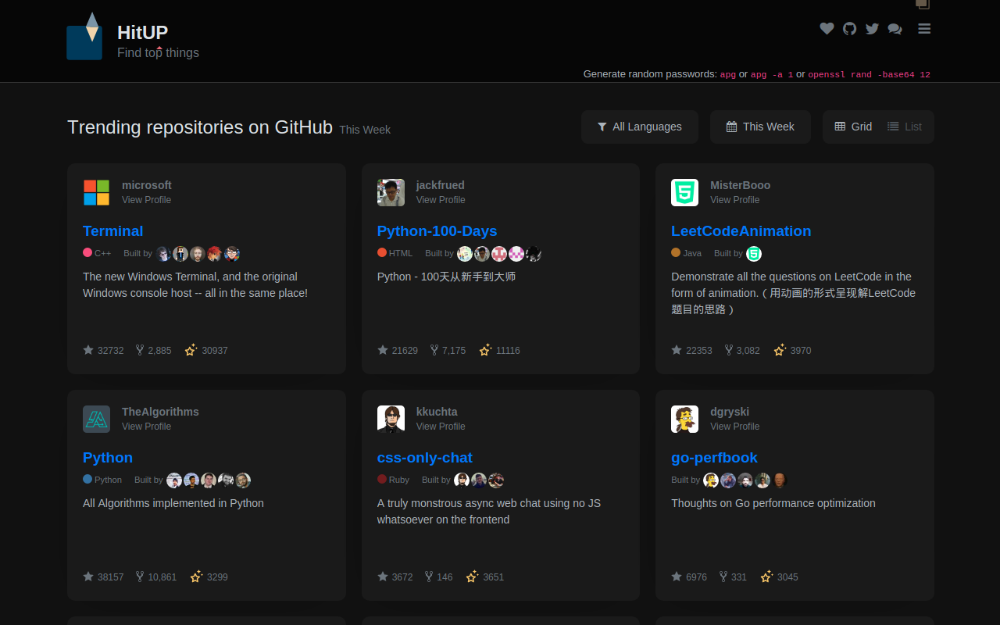
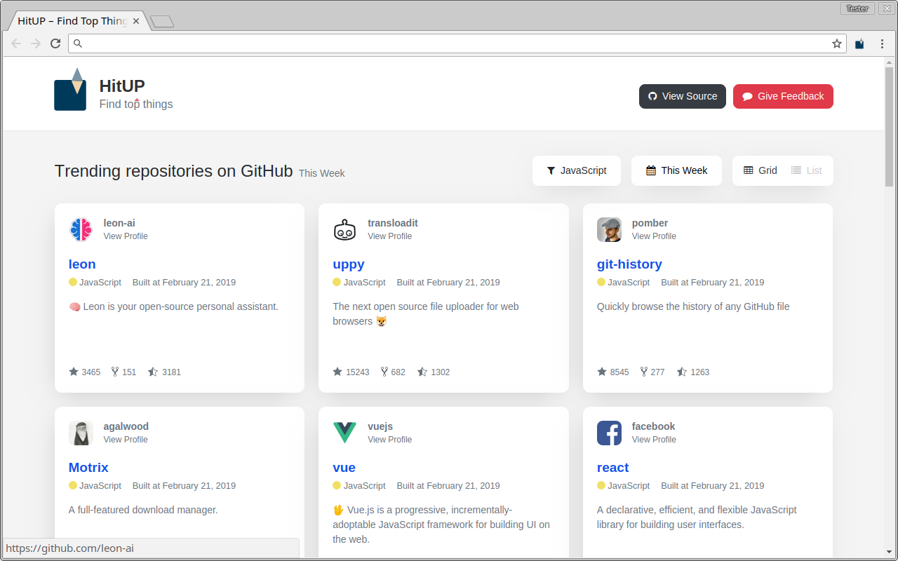
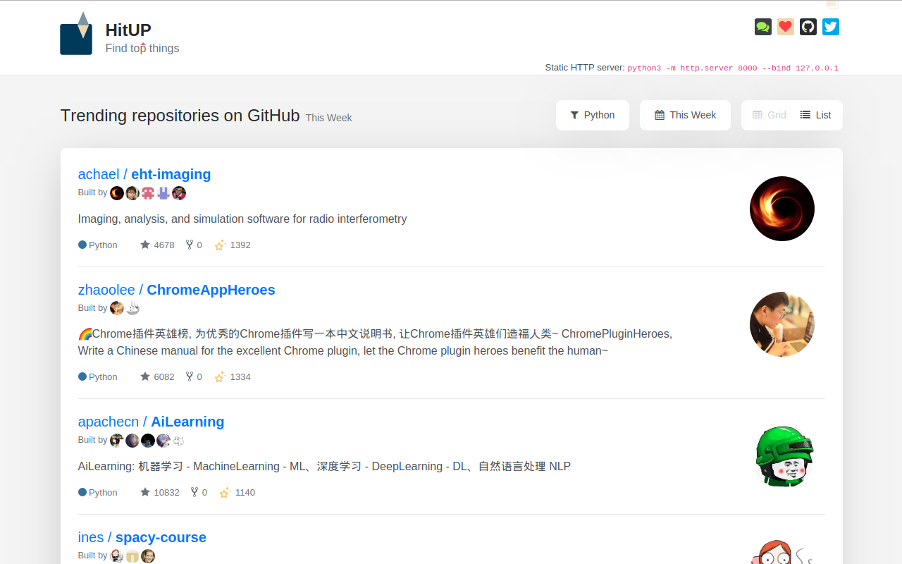
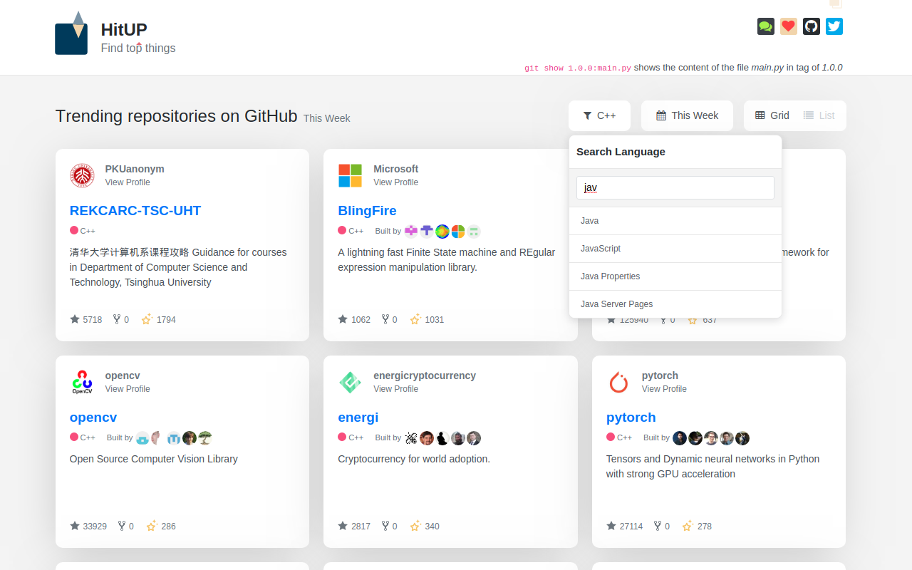

<h1 align="center">
  
   HitUP
</h1>

  
  
  
  

  <b>Find top things in New Tab, including GitHub Trending Repositories</b>
   
  
   
  ✨ You can either use HitUP as <a href="https://chrome.google.com/webstore/detail/hitup-find-top-things/eiokaohkigpbonodjcbjpecbnccijkjb?utm_source=GitHub&utm_medium=wonderbeyond/HitUP" target="_blank">Chrome extension</a> or just <a href="https://hitup.wondertools.top" target="_blank">online</a>

  <b>HitUP</b> is a react app and a browser extension that helps you
   explore top things in New Tab, including the most popular projects on GitHub
    

  
   <b>▲ Awesome! HitUP have Dark Theme now 🎉 🎉 🎉</b> 

  
   <b>▲ Trending Repositories This Week – Grid View</b> 

  
   <b>▲ Trending Repositories This Week – List View</b> 

  
   <b>▲ Filter by Language</b> 

## Installation

* Chrome Extension – https://chrome.google.com/webstore/detail/hitup-find-top-things/eiokaohkigpbonodjcbjpecbnccijkjb?utm_source=GitHub&utm_medium=wonderbeyond/HitUP
* Use Online – https://hitup.wondertools.top

## Contributions

* Spread the word
* Open pull requests
* Reach out with any feedback

## License
MIT © [wonderbeyond](https://github.com/wonderbeyond), [Kamran Ahmed](https://kamranahmed.info)

## Acknowledgments

* [kamranahmedse/githunt](https://github.com/kamranahmedse/githunt):
  HitUP started as a fork of GitHunt, then I totaly changed the data logic to present the real trending repositories.
* HitUP is using [huchenme/github-trending-api](https://github.com/huchenme/github-trending-api)
